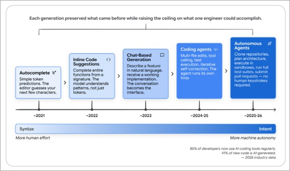
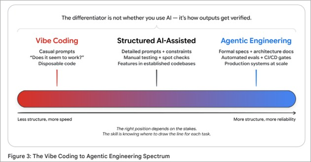
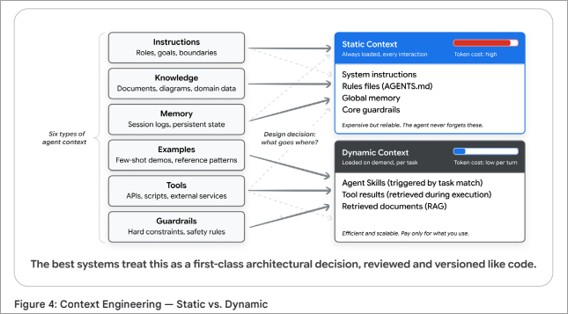
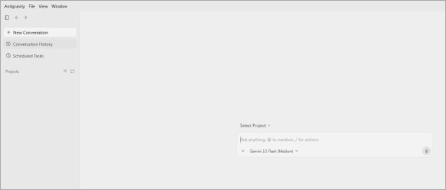
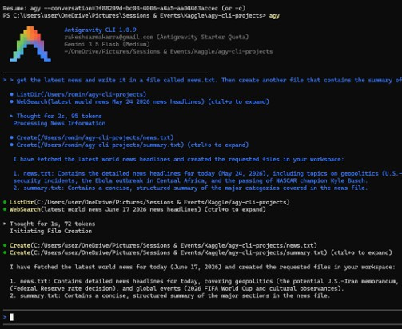
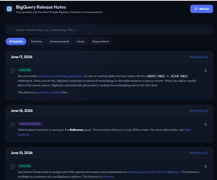
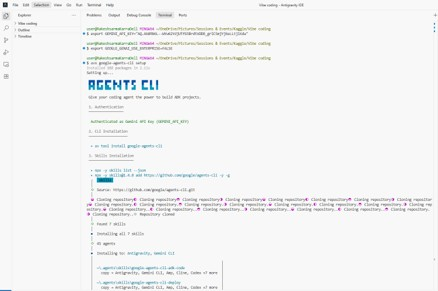
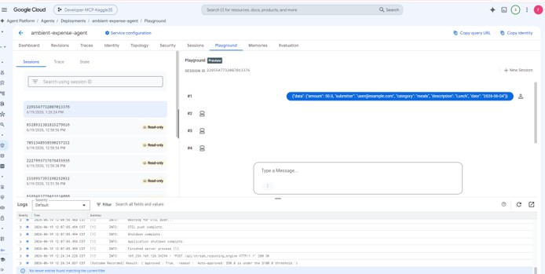
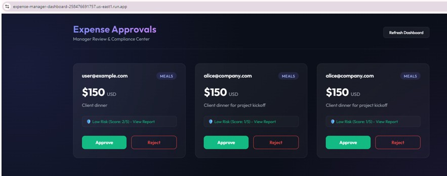

## AI Agents: Intensive Vibe Coding Course with Google

-----------------------------------------------------------------------------------------------------------------------------------------------

## Daywise Assignments, Materials, Labs and my practice screenshots
[Live sessions](https://www.youtube.com/watch?v=7iic3Zj427M&list=PLqFaTIg4myu8AFXUjrVhDkUGp0A9kK8CX&index=2)                             
[Website / Course Info](https://www.kaggle.com/competitions/5-day-ai-agents-intensive-vibecoding-course-with-google/overview)

## Day1: Introduction to Agents & Vibe Coding. 
**Podcast:**  https://www.youtube.com/watch?v=cbzmr7vt4XA                                                                                                                                
**Paper:** https://www.kaggle.com/whitepaper-the-new-SDLC-with-vibe-coding                                                                                                
**Google Antigravity:** https://codelabs.developers.google.com/getting-started-google-antigravity#0                                                                                                                                
**Web App:** https://atmosphere-effects-panel-74392514857.us-west2.run.app/                                                                                                                                

Day 1 introduced the evolution from “vibe coding” (natural‑language driven coding with AI tools) to more disciplined agentic AI engineering, where developers design, configure, and oversee AI agents rather than writing every line of code themselves. The sessions focused on how to structure agent context, why models alone are only a small part of an agent’s real capability, and how to think about orchestration patterns for real workloads.

**Key concepts:**
- Vibe coding vs. agentic engineering
- Context engineering
- Context rot
- Models as engines (10% of agent capability)
- Conductor vs. orchestrator modes
- CapEx vs. OpEx framing
- Antigravity platform
- Antigravity IDE
- Antigravity CLI

## Day2: Agent Tools & Interoperability                                                                                                                                                    
**Podcast:** https://www.youtube.com/watch?v=GjjKXqxFTOY                                                                                                                                                    
**Paper: https:** //www.kaggle.com/whitepaper-agent-tools-and-interoperability                                                                                                               
**Antigravity CLI:** https://codelabs.developers.google.com/antigravity-cli-hands-on#0                                                                                                                                                    
**Google Developer Knowledge MCP server:** https://codelabs.developers.google.com/developer-knowledge-mcp-antigravity                                                                                                               
**Lab1:** https://codelabs.developers.google.com/google-workspace-mcp-antigravity#0 (Optional)                                                                                                               

Day 2 moved from “what is an agent” to “how agents actually take action,” focusing on tools, APIs, and interoperability via the Model Context Protocol (MCP). The sessions covered how to discover and configure MCP servers, avoid monolithic context dumps, and use Antigravity CLI and MCP servers to wire agents into real developer workflows.

**Key concepts:**
- MCP (Model Context Protocol)
- MCP lifecycle: discovery, configuration, connection
- Agent tools and interoperability
- Monolithic context loading vs. runtime retrieval
- Structured outputs and templates
- Google Developer Knowledge MCP server

## Day3: Agent Skills
**Podcast:** https://www.youtube.com/watch?v=uYURYHhpmKc                                                                                                                                                                     
**Paper:** https://www.kaggle.com/whitepaper-agent-skills                                                                                                                                                                    
**Authoriring Google Antigravity Skills:** https://codelabs.developers.google.com/getting-started-with-antigravity-skills?hl=en#1                                                                                  
**Vibe Coding AI Agents:** https://codelabs.developers.google.com/agents-cli-adk-lifecycle#0                                                                                                                           

Day 3 shifted from tools and protocols to Agent Skills: reusable, directory‑based packages that give agents structured knowledge and procedures for specific tasks. The sessions emphasized how skills let agents proceed step‑by‑step instead of improvising everything from raw context, and how Evaluation‑Driven Development (EDD) keeps these skills reliable as they evolve.

**Key concepts:**
- Agent skills as reusable knowledge packages
- Skills vs. MCP (reach vs. procedure)
- Skill authoring with Antigravity
- Vibe‑coding workflows with Agents CLI and ADK
- Progressive disclosure of skills (avoiding tool bloat)
- Evaluation‑Driven Development (EDD)

## Day4: Vibe Coding Security and Evaluation                                                                                                                                        
**Podcast:** https://www.youtube.com/watch?v=Ddz1b8CYPvg                                                                                                                                       
**Paper:** https://www.kaggle.com/whitepaper-vibe-coding-agent-security-and-evaluation                                                                                                                                       
**Vibecode an ADK 2.0 Ambient Agent with Antigravity and Agents CLI:** https://codelabs.developers.google.com/ibecode-ambient-expense-agent#0                                                                                          
**Vibecode and Secure an AI Agent Lifecycle with Antigravity and TDD:** https://codelabs.developers.google.com/secure-agentic-coding#0                                                                                          

Day 4 reframed vibe coding as something that must be secured and measured, not just made productive, focusing on how to keep agentic systems safe as they gain more capabilities. The sessions walked through threat models for agentic coding, practical guardrails for tools and environments, and how to use tests and evaluations to prevent regressions as agents and skills evolve.

**Key concepts:**
- Security risks in vibe coding and agentic coding
- Guardrails for tools, data access, and environments
- Governance and auditability for agent actions
- Evaluation strategies and test suites for agents
- Event‑driven “ambient” agents (expense agent example)
- Securing the agent lifecycle with Antigravity, ADK, and Agents CLI

## Day 5: Spec-Driven Production Grade Development in the Age of Vibe Coding                                                                                                               
**Podcast:** https://www.youtube.com/watch?v=VSRdL4wlbLY                                                                                                                                                    
**Paper:** https://www.kaggle.com/whitepaper-spec-driven-production-grade-development-in-the-age-of-vibe-coding                                                                                                                
**Host your AI agents on Google Cloud:** https://codelabs.developers.google.com/enterprise-cloud-scale-deploying-the-expense-agent-to-agent-runtime-on-google-cloud                                                                          
**Front-end web app and link it to your cloud-hosted AI agent:** https://codelabs.developers.google.com/vibecode-frontend-with-antigravity                                                                          

Day 5 connected everything back to shipping production systems, contrasting fast, exploratory vibe coding with more rigorous spec‑driven development for agents that need to be reliable over time. The sessions focused on writing clear specs before coding, deploying agents to managed runtimes on Google Cloud, and wiring them into real front‑end applications so the full stack is ready for production, not just demos.

**Key concepts:**                                                                                                                                                                                         
- Vibe coding vs. spec‑driven development                                                                                                                                                    
- Specifications as the single source of truth                                                                                                                                                    
- Breaking specs into testable agent tasks                                                                                                                                                    
- Deploying agents to managed runtime on Google Cloud                                                                                                                                                    
- Front‑end integration with cloud‑hosted agents                                                                                                                                                    
- Operational readiness: monitoring, scaling, and updates                                                                                                                                                    

## Capstone Project: 
https://www.kaggle.com/competitions/5-day-ai-agents-intensive-vibecoding-course-with-google/discussion/709721
Note: I will update my cpstone project once I submit to the event.

